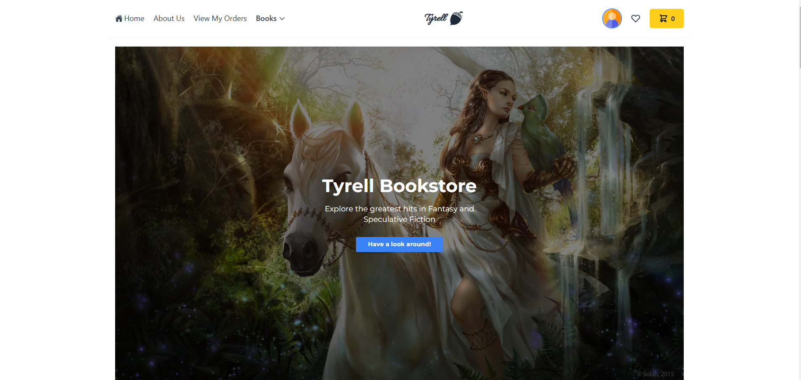

# Tyrell Bookstore

**A full-stack MERN (MongoDB, Express, React, Node) bookstore application with CRUD functionality, Firebase authentication, React-Redux state management, and role-based route protection.**

<br/>

## Click the image to see the demo video (or visit the site link)

[Site Link](https://tyrell-deployment-b1i7brw7b-taha-iqbals-projects.vercel.app/)
To see the demo video, click the image:

[](https://www.youtube.com/watch?v=Kz64tc0Pe0A)

## Technology Stack

### Frontend
- **React 18** (Vite for bundling and dev server)  
- **React Router 7** for client-side routing  
- **Redux Toolkit** & **RTK Query** for global state management and data fetching  
- **Chakra UI** + **Tailwind CSS** for styling and responsive layout  
- **Framer Motion** for animations  
- **Chart.js** / **react-chartjs-2** for rendering analytical charts  
- **Axios** for HTTP requests (used in some places alongside RTK Query)

### Backend
- **Node.js** & **Express** for the server and RESTful APIs  
- **MongoDB** & **Mongoose** for database and schema modeling  
- **CORS** for cross-origin requests  
- **Dotenv** for environment variable management

### Authentication
- **Firebase** (`firebase.auth()`, `GoogleAuthProvider`)  
- **Firestore** not used for data in this project, but **Realtime** authentication state is used for the front-end.  
- Custom backend endpoints sync user data (`/api/real-users`) with MongoDB using the Firebase `uid`.


## Application Architecture

```txt
┌─────────────────────────────────┐
│    React Frontend (Vite)       │
│  - Redux Toolkit               │
│  - React Router                │
│  - Chakra UI / Tailwind        │
│  - Firebase Auth Context       │
└─────────────▲──────────────────┘
              │
              │ (HTTP, RTK Query / Axios)
              │
┌─────────────┴──────────────────┐
│      Express.js Backend        │
│  - RESTful API routes under    │
│    /api/                       │
│  - Admin & Private routes      │
└─────────────▲──────────────────┘
              │
              │ (ODM via Mongoose)
              │
┌─────────────┴──────────────────┐
│          MongoDB Atlas         │
│  - Users, Books, Orders, etc.  │
└─────────────────────────────────┘

```

## Functionality
1. **Add Books to Cart and Checkout**  

2. **View Books By Category**  

3. **Central Home Page**  
  
4. **View Order History**  

5. **Contact Me Form**  
   
6. **Register and Login**  
   
7. **Register and Login With Google**  
---


## Key Features
1. **User Registration & Login**  
   - Firebase Authentication (Email/Password & Google OAuth)  
   - Automatic MongoDB record creation for new users (via `RealUser` collection)

2. **Protected Routes**  
   - **PrivateRoute**: Ensures that certain pages (e.g., Orders) are accessible only to logged-in users.  
   - **AdminRoute**: Allows only admin (or token-based) access to certain pages/statistics.

3. **Redux Toolkit**  
   - Centralized application state with `cartSlice`, `booksApi`, `ordersApi`, `quotesApi`, `realUsersApi`.  
   - RTK Query for asynchronous data fetching and caching of books, orders, quotes, etc.

4. **Bookstore Essentials**  
   - Browse books (with author info, reviews, quotes)  
   - Add to cart, place orders  
   - View past orders (protected route)  
   - Manage authors, reviews, and quotes from the admin perspective

5. **UI/UX Enhancements**  
   - **Chakra UI** & **Tailwind CSS** for styling  
   - **Framer Motion** for smooth animations  
   - **SweetAlert2** for polished alerts and confirmations  
   - **Chart.js** integrated (via `react-chartjs-2`) for analytics

6. **CRUD Operations**  
   - Full suite of Create, Read, Update, Delete endpoints for books, authors, orders, users, reviews, and quotes.


